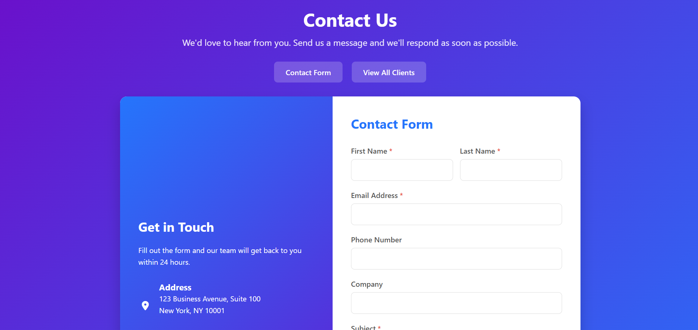
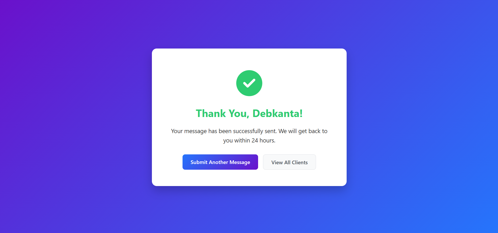
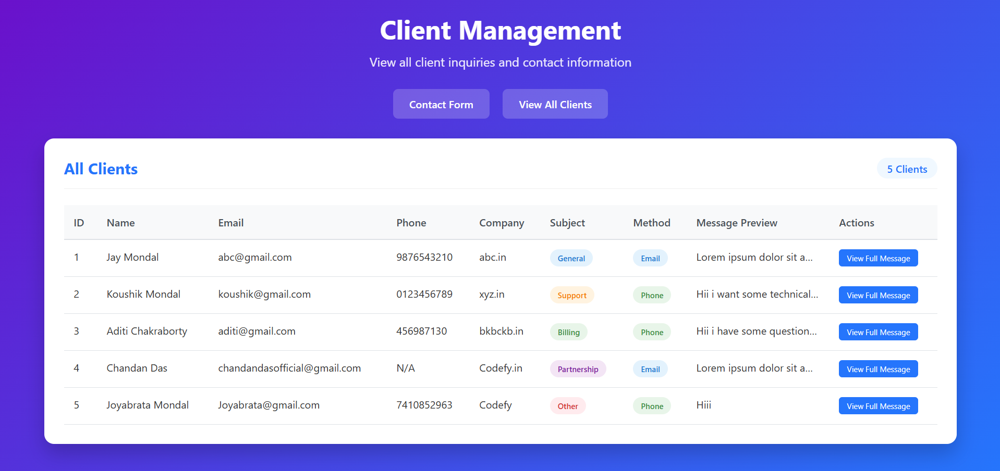

# 📬 Contact Management System

A modern, responsive Flask-based contact form application with SQLite database integration for managing client inquiries and contact information.


## 🌟 Features

- **Interactive Contact Form**: Beautiful, responsive form with client-side validation
- **Database Storage**: All submissions stored in SQLite database
- **Client Dashboard**: View all client inquiries in a clean, organized table
- **Message Preview**: Quick preview with full message modal popup
- **Subject Categorization**: Organize inquiries by subject (General, Support, Billing, Partnership, Other)
- **Contact Method Preference**: Email or Phone contact preference
- **Responsive Design**: Works seamlessly on desktop, tablet, and mobile devices
- **Modern UI/UX**: Gradient backgrounds, smooth animations, and professional styling

## 📸 Screenshots

### Contact Form

*Beautiful gradient design with comprehensive form fields*

### Success Message

*Confirmation page after successful submission*

### Client Dashboard

*View all client inquiries with detailed information and message preview*

## 🚀 Getting Started

### Prerequisites

- Python 3.8 or higher
- pip (Python package installer)

### Installation

1. **Clone the repository**
```bash
   git clone https://github.com/jayMondal45/Contact-Management-System.git
   cd contact-management-system
```

2. **Create a virtual environment** (optional but recommended)
```bash
   python -m venv venv
   source venv/bin/activate  # On Windows: venv\Scripts\activate
```

3. **Install dependencies**
```bash
   pip install flask
```

4. **Run the application**
```bash
   python main.py
```

5. **Open your browser**
```
   http://127.0.0.1:5000
```

## 📁 Project Structure
```
contact-management-system/
│
├── main.py                 # Flask application and routes
├── clients.db              # SQLite database (auto-generated)
├── templates/
│   ├── index.html          # Contact form page
│   ├── clients.html        # Client dashboard page
│   └── success.html        # Success confirmation page
├── screenshots/            # Project screenshots
│   ├── contact-form.png
│   ├── success-message.png
│   └── client-dashboard.png
└── README.md               # Project documentation
```

## 💾 Database Schema

The application uses SQLite with the following schema:

| Column       | Type    | Description                    |
|-------------|---------|--------------------------------|
| id          | INTEGER | Primary key (auto-increment)   |
| first_name  | TEXT    | Client's first name (required) |
| last_name   | TEXT    | Client's last name (required)  |
| email       | TEXT    | Email address (required)       |
| phone_num   | TEXT    | Phone number (optional)        |
| company     | TEXT    | Company name (optional)        |
| subject     | TEXT    | Inquiry subject (required)     |
| method      | TEXT    | Contact preference (required)  |
| message     | TEXT    | Message content (required)     |

## 🎯 Usage

### Submit a Contact Form

1. Navigate to the home page (`/`)
2. Fill in the required fields:
   - First Name *
   - Last Name *
   - Email Address *
   - Subject *
   - Message *
3. Optionally provide:
   - Phone Number
   - Company
   - Preferred Contact Method
   - Newsletter Subscription
4. Click "Send Message"

### View All Clients

1. Navigate to `/clients` or click "View All Clients" button
2. Browse through all submitted inquiries
3. Click "View Full Message" to see complete messages
4. See contact details, subject categories, and preferred contact methods

## 🛠️ Technologies Used

- **Backend**: Flask (Python web framework)
- **Database**: SQLite3
- **Frontend**: HTML5, CSS3, JavaScript
- **Icons**: Font Awesome 6.4.0
- **Styling**: Custom CSS with gradient designs

## 🔒 Security Notes

This is a demonstration project. For production use, consider:

- Input sanitization and validation on the server side
- CSRF protection (Flask-WTF)
- Rate limiting to prevent spam
- Database connection pooling
- Environment variables for sensitive data
- HTTPS implementation
- SQL injection protection (already implemented with parameterized queries)

## 🤝 Contributing

Contributions, issues, and feature requests are welcome! Feel free to check the [issues page](https://github.com/jayMondal45/Contact-Management-System/issues).

1. Fork the project
2. Create your feature branch (`git checkout -b feature/AmazingFeature`)
3. Commit your changes (`git commit -m 'Add some AmazingFeature'`)
4. Push to the branch (`git push origin feature/AmazingFeature`)
5. Open a Pull Request

## 📝 License

This project is licensed under the MIT License - see the LICENSE file for details.

## 👨‍💻 Author

**Jay Mondal**

- GitHub: [@jayMondal45](https://github.com/jayMondal45)
- Project Link: [https://github.com/jayMondal45/contact-management-system](https://github.com/jayMondal45/Contact-Management-System)

## 🙏 Acknowledgments

- Flask documentation and community
- Font Awesome for icons
- Inspiration from modern web design trends

---

⭐ If you found this project helpful, please consider giving it a star!

## 📧 Support

For support, email jaymondals953@gmail.com or open an issue in the GitHub repository.
